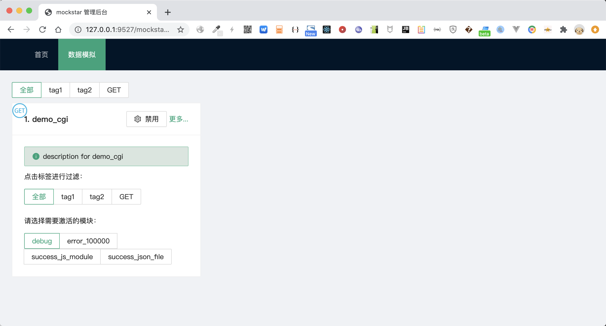
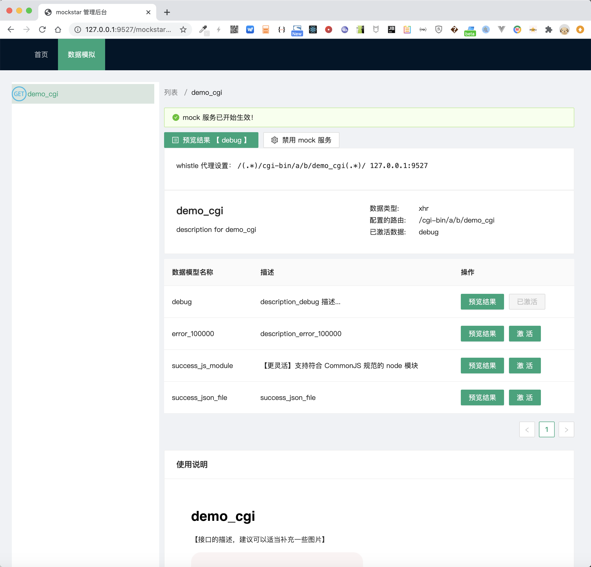
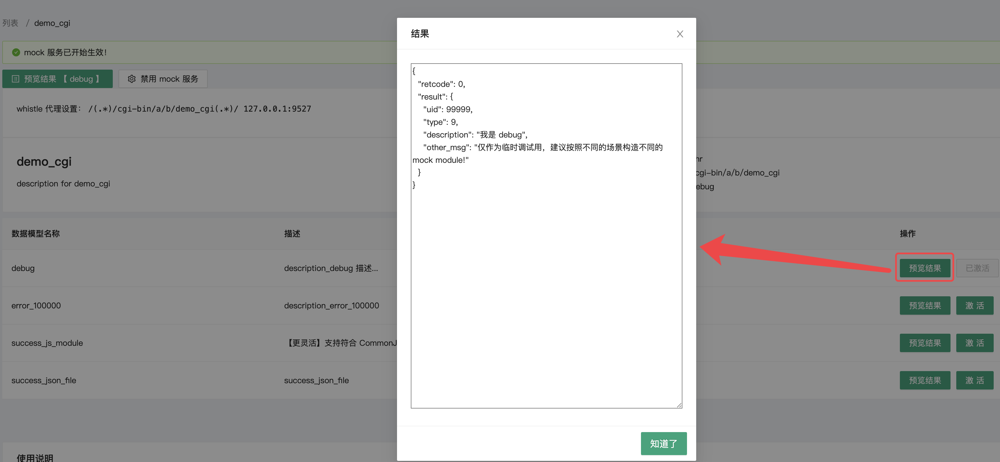
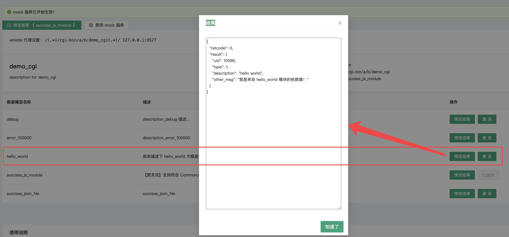

# 快速入门

使用 [create-mockstar-app](https://www.npmjs.com/package/create-mockstar-app) 可以快速生成项目。

## 1. 创建项目

使用下面的一个命令，即可以创建一个名字为 `my-app` 的 MockStar 项目：

> 注意，如果遇到无法安装或执行的情况，可能是因为 npm 未正确配置，可以参考 [安装和升级](../install.html) 一文配置 npm 。

```bash
$ npx create-mockstar-app my-app
```

<div style="text-align: center"></div>


## 2. 启动项目

命令执行完成之后，直接运行启动即可：

```bash
$ cd my-app
$ npm start
```


默认情况下会启动 `9527` 端口，因此直接打开 [http://127.0.0.1:9527](http://127.0.0.1:9527) 进入到管理端页面，并进入到 Mocker 快速操作面板。我们可以看到面板上有一个 `demo_cgi` ，是默认生成的例子。



点击面板右上角的 `更多...` 链接，可以进入详细操作页。



可以点击 `激活` 按钮选择某一个 Mock 数据作为该 Mocker 的返回值，也可以点击 `预览结果` 按钮来预览 Mock 数据的值。





## 3. 使用 Mock 数据

在本例中，我们虚构了一个路由 `/cgi-bin/a/b/demo_cgi` ，你可以通过 whistle 设置如下代理：

```
/(.*)/cgi-bin/a/b/demo_cgi(.*)/ 127.0.0.1:9527
```

然后再通过 [Proxy SwitchyOmega](/tool/proxy-switchyomega.html) 等配置请求走 whistle 端口即可。例如访问 `https://now.qq.com/cgi-bin/a/b/demo_cgi` : 


切换到管理端，点击 `success_js_module` 对应的 `激活` 按钮户，再重新请求一次，可以看到结果接切换到 `success_js_module` 对应的值了。


## 4. 新增一个桩数据

每一种 Mock 数据结果，我们称之为一个 `桩数据`，新增一个也非常简单，支持符合 `CommonJS` 规范的 Node 模块，也支持 `json` 格式的文件。

> 不推荐大家用 `json` 格式的文件。Node 模块的话会更加容易维护和管理。

例如在 `mock_server/demo_cgi/mock_modules` 下新建一个 `hello_world` 的文件夹，创建 `index.js` 和 `config.json` 两个文件，内容如下。

`index.js` 文件内容：

```js
const { getSuccessData } = require('../../base');

/**
 * 学生类型
 *
 * @param {Object} params 请求参数的对象，例如 ?a=1&b=2 ，则 params={a:1,b:2}
 * @param {Object} req 详见 http://expressjs.com/en/4x/api.html#req
 * @return {Promise|*}
 */
module.exports = function (params, req) {
  return getSuccessData({
    uid: params.uid || 10086,
    type: 1,
    description: 'hello world',
    other_msg: '我是来自 hello_world 模块的桩数据！',
  });
};
```

`config.json` 文件内容：

```json
{
  "description": "我来描述下 hello_world 大概是什么"
}
```

刷新管理页面之后看到已经多了一个桩数据了。

> 我们在启动 MockStar 项目时追加了 `--watch` ，这样追加完桩主句之后，就能自动重启并将其识别出来。如果失效，可以先运行 `npm run stop`，然后再重新运行 `npm start` 即可（必要情况下，可以删除临时 `build` 这个临时目录再试一次）。




同理，如果要切换该桩数据，只需要点击对应的 `激活` 按钮即可


